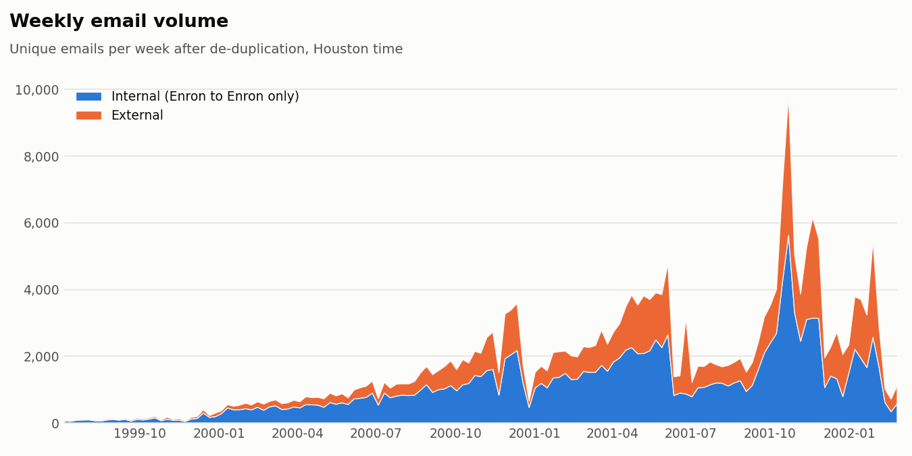
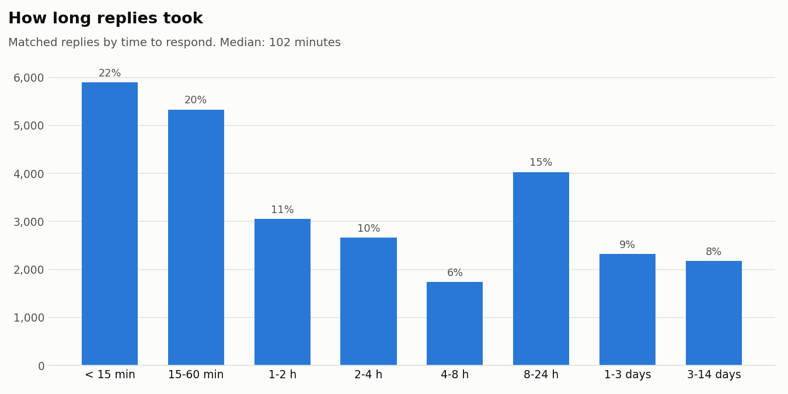
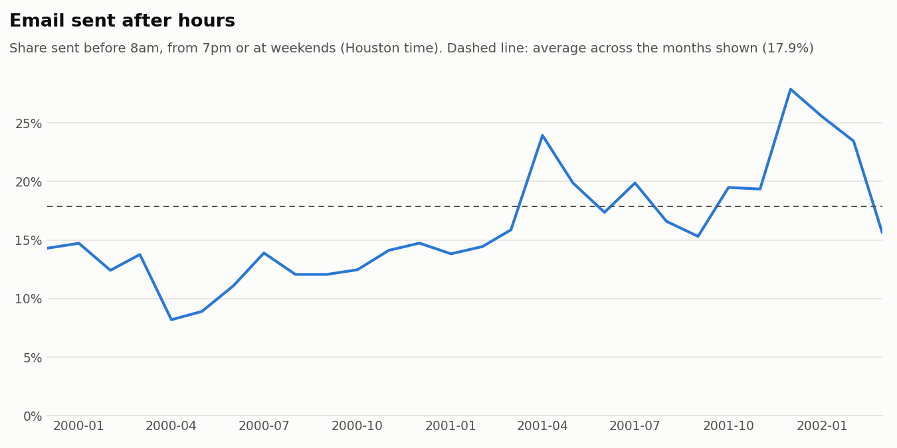
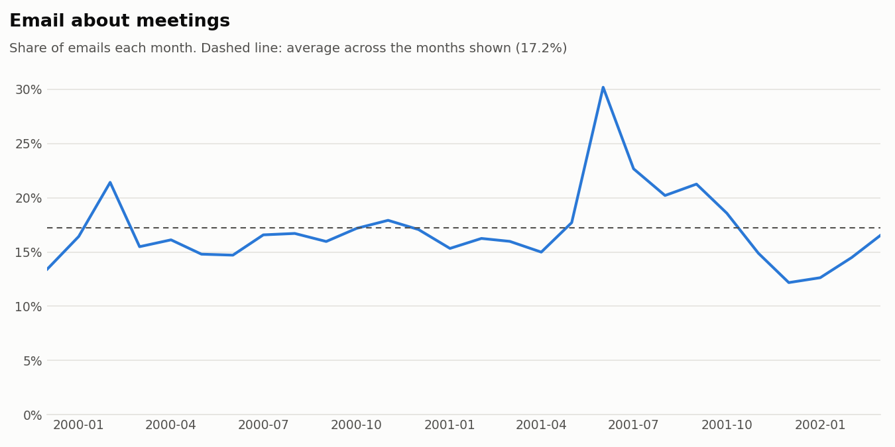
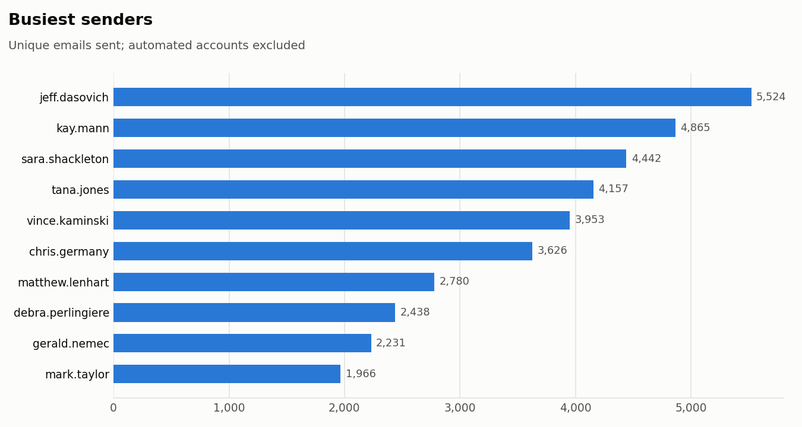
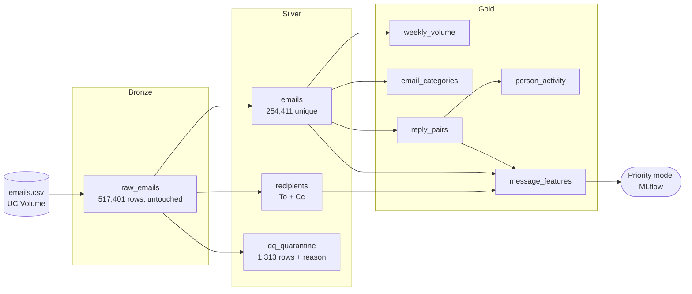
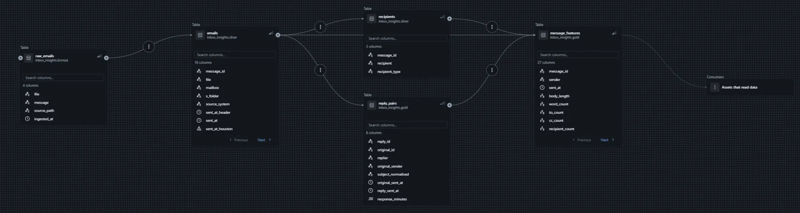
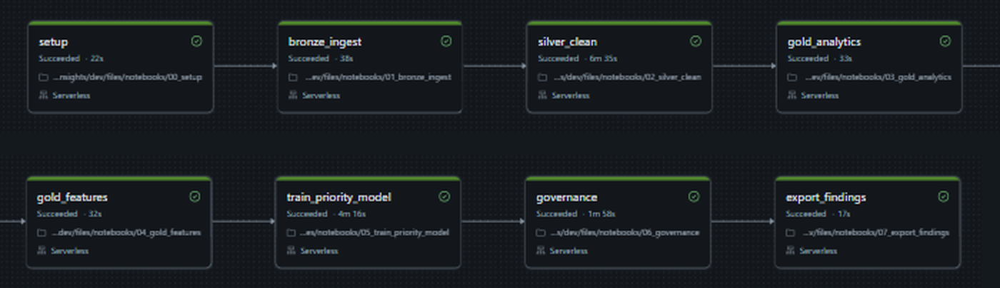

# Inbox Insights

**Where does an organisation's time go in email, and which messages actually need attention?**

A medallion lakehouse on Databricks that takes the full Enron email corpus (517,401 raw
emails from about 150 employees) from a single messy CSV to governed Delta tables, a
reusable ML feature table and an MLflow-tracked priority model.


**Stack:** PySpark · Databricks (serverless) · Delta Lake · Unity Catalog · MLflow ·
Spark ML · Databricks Asset Bundles · pytest · GitHub Actions

This is a rebuild of my earlier
[Email Calendar Evaluation Pipeline](https://github.com/shawn-d123/email-calendar-evaluation-pipeline),
which worked on 1,000 emails in pandas. Its rule-based meeting detector is reused here as
a Spark expression.

---

## What I found

From the 254,411 unique emails left after cleaning and de-duplication:

| | |
|---|---|
| Duplicate copies removed | **261,677 (50.7%)**: the same email stored in several folders and mailboxes |
| Email that stayed inside Enron | **61.8%** |
| Email about meetings | **17.1%** |
| Sent after hours (before 8am, from 7pm or at weekends, Houston time) | **17.7%** |
| Busiest week | **w/c 22 October 2001: 9,820 emails**, the week the SEC inquiry became public |
| Replies matched to the email they answer | **27,204** |
| Median time to reply | **102 minutes**; 52.5% of replies came within 2 hours |

In plain terms: half of the raw corpus is duplicate copies, about one email in six is
about arranging a meeting, and one in six is sent outside working hours. After-hours email
climbed through 2001 as the company went under (chart below). A typical reply took under two
hours, but there is a long tail: 15% of replies took between 8 and 24 hours, roughly
overnight.











The busiest senders were Jeff Dasovich (5,524 emails, median reply 117 min), Kay Mann
(4,865, 58 min) and Sara Shackleton (4,442, 108 min). Tana Jones was the quickest of the top
ten at a 35 minute median. One automated account (`pete.davis`, a schedule-monitoring
mailbox) is left out of the senders chart.

All of these numbers come from [`docs/images/findings.json`](docs/images/findings.json),
which the pipeline writes on every run.

---

## Architecture



| Layer | Table | What it holds |
|---|---|---|
| Bronze | `raw_emails` | The CSV exactly as loaded, plus source path and load time |
| Silver | `emails` | Parsed, cleaned, time-corrected, de-duplicated emails |
| Silver | `recipients` | One row per email and To/Cc recipient |
| Silver | `dq_quarantine` | Rows that failed a quality rule, with the reason |
| Silver | `run_metrics` | Row counts at every stage of every run |
| Gold | `weekly_volume` | Emails per week, internal vs external |
| Gold | `email_categories` | Monthly meeting, after-hours and weekend shares |
| Gold | `reply_pairs` | Each reply matched to the email it answers |
| Gold | `person_activity` | Volume, after-hours load and reply speed per person |
| Gold | `message_features` | ML features and label, one row per email |
| Gold | `model_metrics` | Test results for every training run |

Every table and gold column has a description in Unity Catalog, every table has an owner
and a layer tag, and all 17 columns holding addresses or message text are tagged
`pii = true`. See the [data dictionary](docs/data_dictionary.md).



---

## How it is built

The pipeline logic lives in [`src/inbox_insights/`](src/inbox_insights) as plain functions
that take and return DataFrames. The notebooks only call those functions and write tables,
so the same code is unit tested locally and run on Databricks.

| Module | Job |
|---|---|
| [`parsing.py`](src/inbox_insights/parsing.py) | Split raw messages into headers and body, parse dates and addresses |
| [`cleaning.py`](src/inbox_insights/cleaning.py) | Strip quoted replies and signatures, decode quoted-printable, fix time zones |
| [`quality.py`](src/inbox_insights/quality.py) | Quality rules; failing rows go to quarantine with a reason |
| [`silver.py`](src/inbox_insights/silver.py) | De-duplication and the recipients table |
| [`rules.py`](src/inbox_insights/rules.py) | Meeting, after-hours and internal flags |
| [`gold.py`](src/inbox_insights/gold.py) | Weekly volume, categories, reply matching, person activity |
| [`features.py`](src/inbox_insights/features.py) | Point-in-time features and the reply label |
| [`model.py`](src/inbox_insights/model.py) | Time split, Spark ML pipeline, threshold choice, metrics |
| [`governance.py`](src/inbox_insights/governance.py) | Comments and tags, and the source of the data dictionary |
| [`charts.py`](src/inbox_insights/charts.py) | The charts above |

The whole pipeline is one Databricks Job defined in
[`resources/job.yml`](resources/job.yml) and deployed with Databricks Asset Bundles. A full
run takes about 15 minutes on serverless compute. The weekly schedule is set up but
paused, because Free Edition has a daily compute quota.



91 pytest tests run on a local SparkSession with hand-written emails, and GitHub Actions
runs them (plus `ruff` lint and format checks) on every push.

---

## Data problems worth knowing about

Most of the time on this project went into finding out what was wrong with the data.

**Half the corpus is copies.** The same email sits in a person's inbox, their
`all_documents` folder and every recipient's mailbox, and each copy has a different
Message-ID. De-duplicating on Message-ID removed nothing; matching on sender, send time,
subject and a hash of the body removed 261,677 rows.

**Lotus Notes timestamps are shifted.** Every Date header in the corpus claims to be US
Pacific time, but on the 118,940 unique emails exported from Lotus Notes it is not. I
checked the header times against the "Forwarded by ... on" stamps Lotus writes into the
body, and across about 3,500 emails the body stamp was always exactly 7 hours later (8 in
winter). The header's UTC value is really Houston local time. Outlook exports are correct.
Without the fix, 45% of email on the development sample looked like it was sent after
hours; with it, the full corpus comes out at 17.7%.

**The Bcc header is a copy of Cc** on every email that has one, so recipients are taken
from To and Cc only to avoid double counting.

**Quoted text hides the real message.** Bodies are cut at `-----Original Message-----`,
Lotus "Forwarded by" blocks, `From:`/`To:` header blocks and signatures, which halves the
average body length. The meeting flag uses the full body, because a forwarded meeting
notice is still about a meeting.

**Regex behaves differently on serverless.** The first full run quarantined every single
email as `unparseable_date`: on Databricks serverless, `.` matched newlines under the
multi-line flag, so the Date header swallowed every header after it. The quarantine caught
it instead of letting an empty silver table through. The patterns now avoid `.` and `$`
for line matching, and the silver notebook fails the job if more than 5% of rows are
quarantined.

### Meeting detector compared with the old project

Scored on the same 20 hand-labelled Enron emails from the earlier project
([`benchmarks/`](benchmarks)):

| | Precision | Recall | F1 |
|---|---|---|---|
| Original pandas rule | 0.857 | 0.857 | 0.857 |
| Spark rule (full body) | 1.000 | 0.857 | **0.923** |

Twenty emails is a sanity check rather than a proper benchmark, and the rule was not tuned
to them.

---

## Priority model

**Question:** will anyone reply to this email within 2 hours?

- **Rows:** 89,457 emails sent to one of the mailbox owners. Only for them can a missing
  reply be trusted, because their sent mail is in the corpus.
- **Label:** a matched reply within 120 minutes (7.75% of rows).
- **Features:** 22 point-in-time features (content, sender history, how often these
  recipients have replied to this sender before, time of day, urgency and meeting flags)
  plus TF-IDF on the subject and body.
- **No leakage:** nothing used to build the label is a feature, every history feature only
  looks at earlier emails, and TF-IDF is fitted on the training period only. A test adds
  future emails and checks no earlier feature changes.
- **Split by time:** the decision threshold was chosen on 22 October to 19 November 2001,
  using a model trained on the email before it. The final model was then trained on
  everything up to 19 November and tested once on the 17,966 emails after that
  (11.2% positive).

Model: Spark ML logistic regression with class weights, tracked in MLflow.

| On the test period | Precision | Recall | F1 |
|---|---|---|---|
| Always predict "no reply" | 0.000 | 0.000 | 0.000 |
| Rule: recipients have replied to this sender before | 0.170 | 0.664 | 0.271 |
| Logistic regression, threshold 0.50 | 0.250 | 0.252 | 0.251 |
| **Logistic regression, threshold 0.25 (chosen on validation)** | **0.208** | **0.444** | **0.283** |

PR-AUC is 0.204 against a base rate of 0.112, and ROC-AUC is 0.685.

The model picks up real signal: it beats the simple rule while flagging far fewer emails,
and its precision-recall curve sits well above chance. It is still a weak predictor, and I
think that is the honest result. Most of what decides whether someone replies quickly is
not in the email itself: whether they are at their desk, whether they picked up the phone
instead. The test period also covers the bankruptcy and its aftermath, a very different
few months from anything the model trained on.

---

## Running it

See [`docs/how_to_run.md`](docs/how_to_run.md) for the full steps. In short:

```bash
pip install -e ".[dev]"
pytest
databricks bundle deploy
databricks bundle run inbox_insights_pipeline
```

## Repo layout

```
src/inbox_insights/   pipeline logic (tested)
notebooks/            00_setup to 07_export_findings, thin wrappers for the job
resources/job.yml     Databricks Job definition
tests/                pytest suite on a local SparkSession
benchmarks/           20 labelled emails for the meeting rule
scripts/              sampling, benchmark and data dictionary scripts
docs/                 data dictionary, how-to-run guide and images
```

## What I would do next

- Move the pipeline to Lakeflow Declarative Pipelines and express the quality rules as
  expectations.
- Process new email incrementally with Auto Loader instead of full rebuilds.
- Try a gradient-boosted model and recipient-level features, such as how busy the
  recipient was that day.
- Serve the model behind a Databricks Model Serving endpoint.

## Licence

MIT. The Enron corpus is public and was released by the US Federal Energy Regulatory
Commission.
